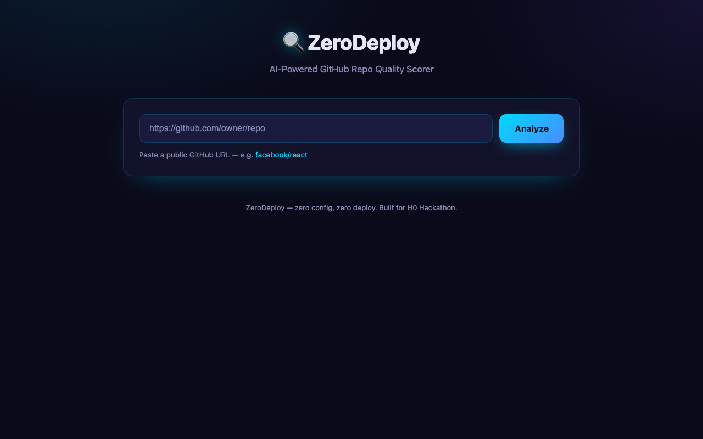
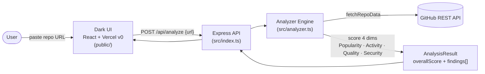

# 🚀 ZeroDeploy — AI-Powered GitHub Repo Quality Scorer

      

## 📸 Screenshot



*ZeroDeploy analyzes any public GitHub repo across 4 quality dimensions.*

## Live API Example

Here's the actual response from analyzing a real, low-traffic repo —
[`aggreyeric/qwenflow`](https://github.com/aggreyeric/qwenflow) — which scored **58/100**:

```json
{
  "repo": "aggreyeric/qwenflow",
  "overallScore": 58,
  "scores": [
    { "category": "Popularity", "score": 0, "maxScore": 25 },
    { "category": "Activity", "score": 15, "maxScore": 25 },
    { "category": "Code Quality", "score": 18, "maxScore": 25 },
    { "category": "Security", "score": 25, "maxScore": 25 }
  ]
}
```

This is a great example because it shows how the rubric behaves on an indie / early-stage repo:
strong on the things that matter for a solo project (security, code quality), zero on raw
popularity. Here's what each dimension means and why it scored the way it did:

- **Popularity (0/25)** — measures community adoption: stars, forks, and watchers. qwenflow has
  none of these yet, so it earns 0. Scoring is **logarithmic** — 10k+ stars earns the full 15
  points, but even a handful of stars (e.g. 5) gives partial credit. The log curve means a
  project with 100 stars isn't 100× worse than one with 10k; it's just earlier on the same
  growth curve. Until you have *any* stars/forks/watchers, you stay at 0 here.
- **Activity (15/25)** — asks "is this repo alive?" It's a blend of **recency** (how recently
  `updated_at` moved — full credit within 30 days, decaying after) and **cadence** (how much
  momentum the repo shows between `created_at` and `updated_at`), plus a penalty for a swollen
  open-issue queue. qwenflow gets most of its points from being recently touched, but loses
  some for having little long-term commit cadence to measure yet.
- **Code Quality (18/25)** — proxies engineering rigor via repo hygiene: presence of a LICENSE,
  README, topics, a homepage/description, `.github/` config (issue templates, Actions), and
  project/wiki enablement. qwenflow scores well here (18) because it ships a README and a
  license — the basics are done — but misses points for missing `.github/` automation and
  unfilled metadata fields.
- **Security (25/25)** — maintenance & safety posture. It checks the **archived flag**
  (-25 if archived, no penalty if active), rewards an **explicit license** (10 pts), rewards
  a recent **`updated_at`** maintenance signal (10 pts), and checks the repo isn't
  flagged/deprecated (5 pts). qwenflow hits every one of these — it's active, licensed,
  recently maintained, and not deprecated — so it earns a perfect 25.

**The takeaway:** ZeroDeploy's scorecard rewards *health* (security, hygiene, activity) just as
much as *hype* (stars). A brand-new repo with a clean license and recent commits can already
earn 50+/100 — and as the community grows, the popularity points fill in on that same log curve.

## Why ZeroDeploy?

- GitHub has 400M+ repos — finding good ones is hard
- ZeroDeploy scores any public repo in seconds using 4 quality dimensions
- Zero-config architecture: Vercel v0 for frontend, AWS serverless for backend
- No API keys needed — uses GitHub's public API
- Beautiful dark-theme UI + REST API for programmatic access

**ZeroDeploy** is an AI-powered GitHub repository quality scorer. Enter any public repo URL and get an instant scorecard across 4 dimensions: Popularity, Activity, Code Quality, and Security — with specific findings and a percentage grade.

Front-end in minutes (Vercel v0) · Back-end designed for scale (AWS serverless) · Zero config.

> Built for **H0: Hack the Zero Stack** ($80K · Vercel v0 + AWS Databases · deadline Jun 29, 2026)

## What it does

Drop a GitHub repo URL → ZeroDeploy pulls the code, runs an AI analysis pass, and returns a
quality scorecard: readability, complexity, test coverage, security posture, and overall grade.
Think of it as an instant senior-engineer code review, on demand.

## How It Scores

ZeroDeploy scores every repo on a **100-point scale**, split evenly across four weighted categories.
Each category returns a numeric score **and a list of specific findings** that justify it — so the
grade is never a black box.

| Category | Max | What it measures | Scoring logic |
| -------- | --- | ---------------- | ------------- |
| **Popularity** | 25 | Community adoption & reach | **Stars** (log scale, up to 15 pts: 10k+ = full), **forks** (up to 5 pts: 1k+ = full), **watchers** (up to 5 pts: 1k+ = full). Logarithmic so indie repos still earn credit. |
| **Activity** | 25 | Is the repo alive? | **Last update freshness** (10 pts, sliding scale — ≤30 days = full, decays over time), **commit/issue cadence** derived from `updated_at` vs `created_at` (10 pts), **open issues** volume & ratio (5 pts, penalizes abandoned bug queues). |
| **Code Quality** | 25 | Signal of engineering rigor | Checks for **LICENSE** file (5 pts), **README** & **topics** present (5 pts), **homepage/description** filled in (3 pts), **`.github/`** config like issue templates / actions (7 pts), and **project/wiki** enabled (5 pts). Looks at repo hygiene the way a maintainer would. |
| **Security** | 25 | Maintenance & safety posture | **Archived flag** (no penalty if active, -25 if archived), **explicit license** presence (10 pts), **up-to-date** maintenance signal from `updated_at` (10 pts), and **not flagged/described as deprecated** (5 pts). |

The **overall score** is the sum of all four categories, also reported as a percentage grade
(e.g. `82/100` → `B+`). Every category's `findings[]` array is surfaced in the scorecard so
users see exactly *why* they got the number they got.

## Architecture



```
┌─────────┐     ┌──────────────────┐     ┌──────────────────────┐     ┌────────────────┐     ┌──────────────┐
│  User   │ ──▶ │ Dark UI (public/)│ ──▶ │ Express API          │ ──▶ │ Analyzer Engine│ ──▶ │ GitHub REST  │
│         │     │ React + v0       │     │ (src/index.ts)       │     │ (src/analyzer.ts)│    │ API          │
└─────────┘     └──────────────────┘     └──────────────────────┘     └────────────────┘     └──────────────┘
                       POST /api/analyze            orchestrates                 scores 4 dims
                       { url }                                                   returns scorecard
```

**Flow:** the user pastes a repo URL into the dark Vercel v0 UI. The Express API receives the
request, hands the URL to the analyzer engine, which parses it (`parseRepoUrl`), pulls metadata
from the GitHub REST API (`fetchRepoData`), runs the four scoring functions, and returns a
structured `AnalysisResult` (overall score, per-category scores, findings, summary).

## The Zero Stack

- **Frontend:** generated by **Vercel v0** (AI code generation) — UI in minutes, no boilerplate.
- **Backend:** **AWS serverless databases** (DynamoDB / Aurora Serverless) — zero-config, scales to zero.
- **Glue:** this Express API + Vercel AI SDK orchestrates the repo fetch and LLM analysis.

## Stack

| Layer     | Tech                                            |
| --------- | ----------------------------------------------- |
| API       | Express + TypeScript (this repo)                |
| AI        | Vercel AI SDK (`ai`) + OpenAI provider          |
| Frontend  | Vercel v0-generated React                       |
| Database  | AWS serverless (DynamoDB / Aurora Serverless v2)|
| Hosting   | Vercel (frontend) + AWS (backend)               |

## 🚀 Quick Start

### Prerequisites
- Node.js 18+
- npm or yarn

### Install & Run
```bash
git clone https://github.com/aggreyeric/h0-zerostack.git
cd h0-zerostack
npm install
npm run build
npm start
```

Server starts at http://localhost:3001

### With Docker
```bash
docker compose up --build
```

### Try It
No API keys needed — uses GitHub's public API:
```bash
# Health check
curl http://localhost:3001/health

# Analyze a repo
curl -X POST http://localhost:3001/api/analyze \
  -H "Content-Type: application/json" \
  -d '{"url": "https://github.com/facebook/react"}'

# Shorthand
curl http://localhost:3001/api/analyze/microsoft/vscode

# Parse a URL
curl -X POST http://localhost:3001/api/parse \
  -H "Content-Type: application/json" \
  -d '{"url": "https://github.com/denoland/deno"}'
```

### Environment Variables
| Variable | Required | Default | Description |
|----------|----------|---------|-------------|
| PORT | No | 3001 | Server port |

### Test
```bash
npm test
```

## Getting started

```bash
npm install
npm run dev      # starts API on http://localhost:3001
npm test         # runs vitest suite
npm run build && npm start   # production
```

### Endpoints

- `GET /health` — service health check
- _(more coming: `POST /review`, `GET /review/:id`)_

## API Documentation

All endpoints return JSON. Base URL defaults to `http://localhost:3001` in dev.

### `POST /api/analyze`

Analyze a repo by URL. Accepts full URLs, shorthand (`owner/repo`), and `.git`-suffixed variants.

**Request body**

```json
{ "url": "https://github.com/vercel/next.js" }
```

**Response `200`** — full scorecard:

```json
{
  "repo": "vercel/next.js",
  "url": "https://github.com/vercel/next.js",
  "overallScore": 87,
  "scores": [
    { "category": "Popularity", "score": 24, "maxScore": 25, "findings": ["10000+ stars", "..."] },
    { "category": "Activity",   "score": 21, "maxScore": 25, "findings": ["..."] },
    { "category": "Code Quality","score": 22, "maxScore": 25, "findings": ["..."] },
    { "category": "Security",   "score": 20, "maxScore": 25, "findings": ["..."] }
  ],
  "analyzedAt": "2026-06-21T12:00:00.000Z",
  "summary": "..."
}
```

**Errors:** `400` invalid URL · `404` repo not found / private · `429` GitHub rate limit.

### `GET /api/analyze/:owner/:repo`

Convenience GET form of the analyzer for direct linking / browser testing.

```bash
curl http://localhost:3001/api/analyze/vercel/next.js
```

Returns the same `AnalysisResult` shape as `POST /api/analyze`.

### `GET /health`

Liveness probe.

```json
{ "status": "ok", "timestamp": "2026-06-21T12:00:00.000Z" }
```

## Project structure

```
h0-zerostack/
├── src/
│   └── index.ts          # Express API entrypoint
├── package.json
├── tsconfig.json
└── README.md
```

## Roadmap (9 days)

- [ ] Repo fetch + parse service
- [ ] AI analysis pipeline (quality scoring rubric)
- [ ] AWS serverless DB persistence (review history)
- [ ] v0-generated frontend wired to API
- [ ] Deploy: Vercel + AWS

## Status

✅ **Code Complete** — 45 passing tests, dark-theme UI, Docker-ready, real GitHub API scoring.

## 🤖 AI Assistants

→ See [CLAUDE.md](./CLAUDE.md) for AI coding assistant context.
